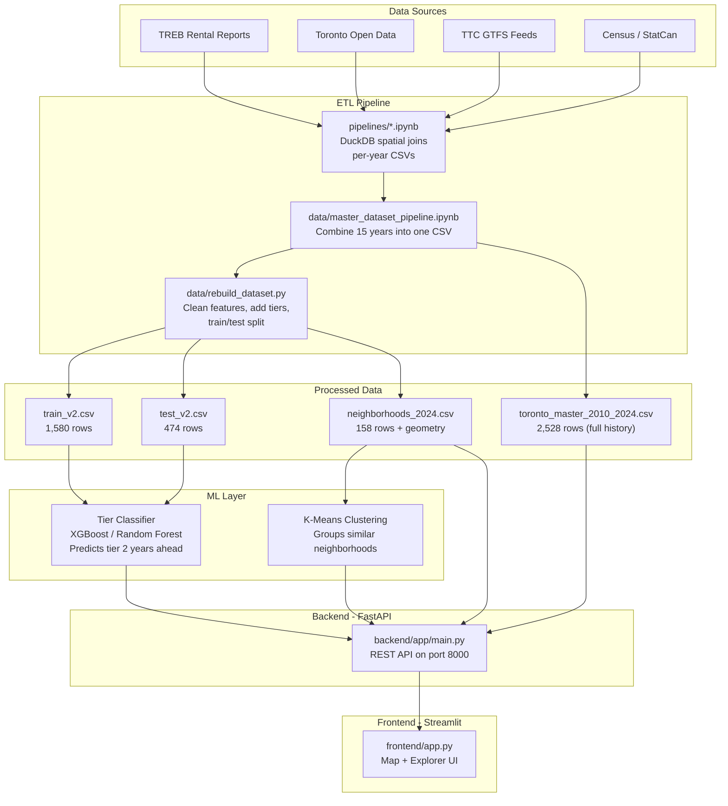
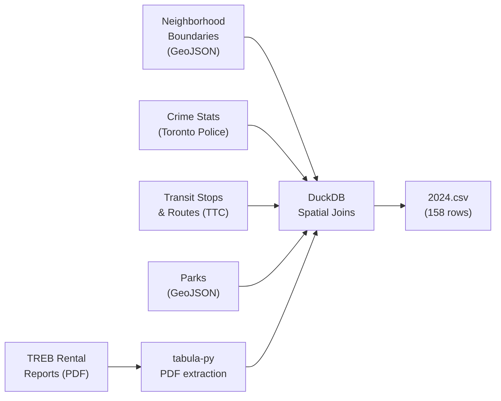
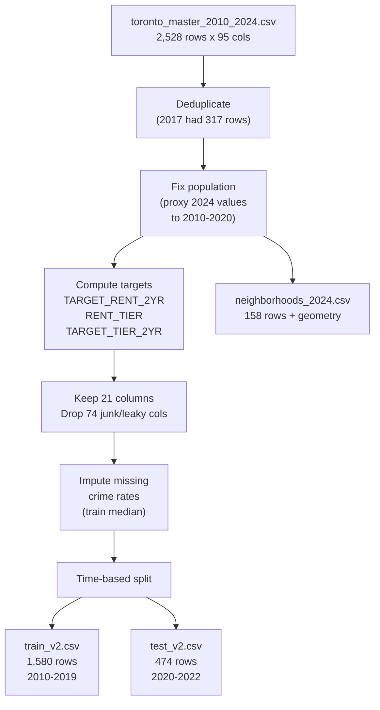
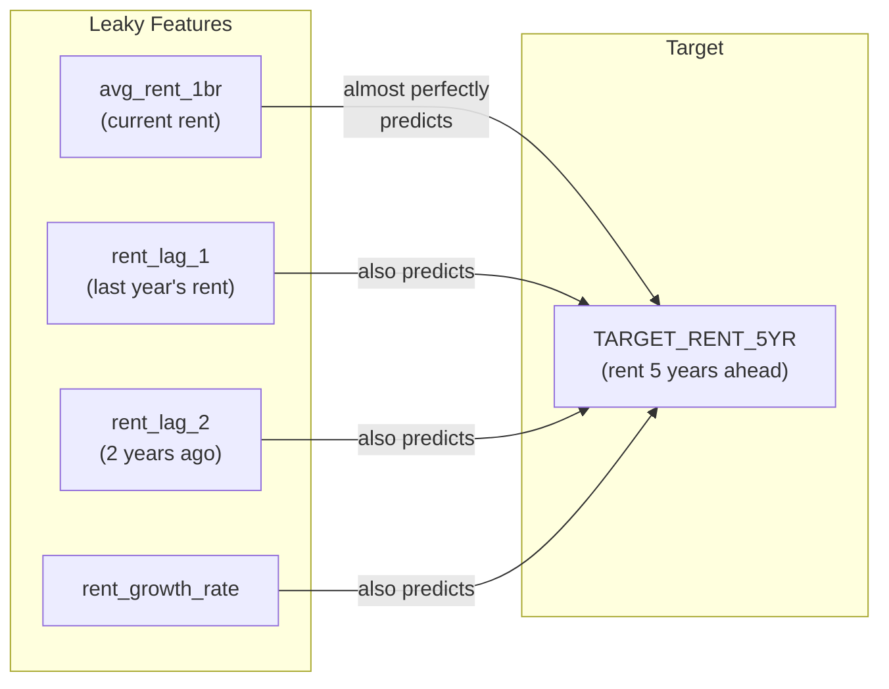
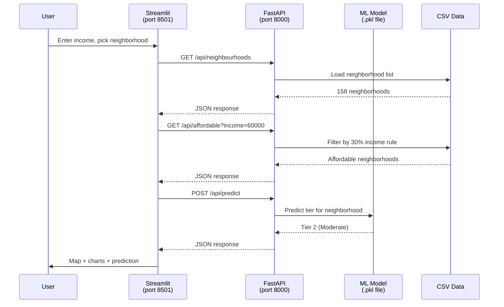

# Architecture — Toronto Rent Explorer

This document explains how the project works, why decisions were made, and how all the pieces connect. If you're new to the codebase, start here.

---

## What This Project Does

We built a tool that helps students and young adults in Toronto understand rental affordability across 158 neighborhoods. It combines 15 years of open data (2010-2024) with machine learning to:

1. Let users explore neighborhood rent, crime, transit, and green space data on an interactive map
2. Predict which **affordability tier** (Budget / Moderate / Expensive / Premium) a neighborhood will fall into 2 years from now
3. Filter neighborhoods by what a user can actually afford based on their income
4. Find similar neighborhoods via clustering ("I like the Annex but can't afford it — what's similar but cheaper?")

---

## High-Level Architecture



---

## Data Pipeline

This is the most complex part of the project. Data flows through three stages.

### Stage 1: Raw Data Collection (pipelines/)

Each year from 2010-2024 has its own pipeline notebook that uses **DuckDB** with spatial extensions to join multiple data sources for 158 Toronto neighborhoods:



Each year's CSV has 158 rows (one per neighborhood) with columns for rent rates, crime rates, transit metrics, park counts, and population.

**Why DuckDB?** It handles spatial joins (point-in-polygon, intersection) natively without needing PostGIS. The pipelines run as standalone notebooks with no database server required.

**Why per-year notebooks?** Each year's TREB data comes in a slightly different format (some years have quarterly data, some annual). The per-year notebooks handle these format differences individually, then output a standardized CSV.

### Stage 2: Master Dataset Assembly (data/master_dataset_pipeline.ipynb)

This notebook stacks all 15 year-CSVs into a single longitudinal dataset:

1. Loads all `raw_data/20XX.csv` files
2. Strips year suffixes from column names (e.g., `ASSAULT_RATE_2024` becomes `ASSAULT_RATE`)
3. Engineers rent features (averages quarterly data where available)
4. Proxies static features from 2024 to all prior years (transit, parks, area)
5. Creates temporal features (lag, growth rate)
6. Exports `toronto_master_2010_2024.csv` (2,528 rows x 95 columns)

### Stage 3: Rebuild for ML (data/rebuild_dataset.py)

The master CSV has problems for modeling (see "Why We Pivoted" below). The rebuild script fixes them:



**Why a script instead of a notebook?** Reproducibility. Notebooks have hidden state (cell execution order matters). The script runs the same way every time and can be version-controlled cleanly.

---

## Why We Pivoted

The original goal was to predict exact rental dollar amounts using XGBoost regression. After 5 systematic training iterations, we proved this doesn't work with our data. Here's why:

### The Data Leakage Problem



Rent is highly autocorrelated. If a neighborhood charges $2,000/month today, it will probably charge ~$2,200 in 5 years. The model learns this shortcut ("just copy the current rent and add a bit") and ignores all other features. It gets 100% R-squared on training data but fails on test data because the shortcut breaks when market conditions shift.

### The Static Feature Problem

The non-rent features (crime rates, transit, parks, population) are copied from 2024 to all prior years. They don't change over time per neighborhood, so the model can't learn "neighborhoods that got more transit saw rent increase." They're just neighborhood identity tags.

### What We Tried

| Iteration | What We Did | Result |
|-----------|-------------|--------|
| 1 | Baseline XGBoost | 100% train R-squared. Suspected leakage. |
| 2 | Stronger regularization | Overfitting persists |
| 3 | Constrained grid search | Confirmed training procedure isn't the issue |
| 3.5 | SHAP diagnostics | Overfitting on subset of features in "dumb" model too |
| 4 | Linear Regression + Random Forest | Same findings. Not XGBoost-specific. |
| 5 | Remove offending features, check correlations | Confirmed data problem: leakage + ceiling effect |

### The Pivot

Instead of predicting exact dollar amounts (regression), we:

1. **Classify neighborhoods into tiers** (Budget / Moderate / Expensive / Premium) based on quartiles. This removes the leakage because the model never sees raw rent values.
2. **Make the data itself the product.** 15 years of neighborhood-level data across 158 areas is genuinely valuable for exploration, even without a perfect predictive model.

---

## ML Components

### Tier Classifier

Predicts which affordability tier a neighborhood will be in 2 years from now.

```
Input:  14 base numeric + 6 engineered ratios + 1 categorical = 21 features
Output: Tier 1-4 (Budget / Moderate / Expensive / Premium)
```

**Base features (15):**

| Category | Features | Why |
|----------|----------|-----|
| Geography | `area_sq_meters`, `perimeter_meters`, `CLASSIFICATION_CODE` | Neighborhood size and region |
| Crime | `ASSAULT_RATE`, `AUTOTHEFT_RATE`, `ROBBERY_RATE`, `THEFTOVER_RATE` | Safety signal |
| Transit | `total_stop_count`, `avg_stop_frequency`, `max_stop_frequency`, `total_line_length_meters`, `transit_line_density`, `distinct_route_count` | Accessibility |
| Green Space | `park_count` | Livability |
| Demographics | `POPULATION` | Density proxy |

**What is NOT a feature:** `avg_rent_1br` (current rent). Including it would leak the target because current rent tier almost perfectly predicts future rent tier. The whole point is to predict tier from neighborhood characteristics alone.

**Train/test split:** Time-based. Train on 2010-2019 (1,580 rows), test on 2020-2022 (474 rows). No random shuffling because this is temporal data — the model should never see future data during training.

**Feature engineering:** We added 6 ratio features that dramatically improved signal quality:

| Feature | Correlation with Target | Why It Helps |
|---------|------------------------|--------------|
| `park_density` (parks / area) | 0.47 | Raw `park_count` (0.01 corr) doesn't account for neighborhood size |
| `pop_density` (population / area) | 0.38 | Raw `POPULATION` (0.04 corr) misses that density drives rent |
| `transit_per_capita` (stops / population) | 0.29 | Normalizes transit access for neighborhood population |
| `total_crime_rate` (sum of 4 rates) | 0.07 | Single safety signal instead of 4 noisy ones |
| `compactness` (perimeter^2 / area) | varies | Irregular shapes often straddle different zones |
| `routes_per_stop` (routes / stops) | varies | Measures transit connectivity, not just stop count |

**Model selection:** We trained both XGBoost and Random Forest with a hyperparameter sweep, then picked the best by macro F1 score. Random Forest won.

**Results (on test set, 2020-2022):**

| Model | Accuracy | Macro F1 |
|-------|----------|----------|
| Random Forest (selected) | 64.8% | 0.651 |
| XGBoost | 61.8% | 0.622 |

Per-tier performance (Random Forest):

| Tier | Precision | Recall | F1 |
|------|-----------|--------|----|
| Budget | 0.75 | 0.69 | 0.71 |
| Moderate | 0.55 | 0.66 | 0.60 |
| Expensive | 0.59 | 0.52 | 0.55 |
| Premium | 0.73 | 0.75 | 0.74 |

65% accuracy is 2.6x better than random guessing (25% for 4 classes). Most errors are between adjacent tiers (Budget<->Moderate, Expensive<->Premium) — neighborhoods near a tier boundary could plausibly go either way. The model cannot capture temporal dynamics (gentrification, new transit lines) because those aren't in the features.

SHAP analysis shows park_density, pop_density, and transit features are the strongest predictors of affordability tier.

**Artifacts:**
- `models/tier_classifier.pkl` — model bundle (Random Forest + metadata)
- `models/label_encoder.pkl` — LabelEncoder for `CLASSIFICATION_CODE`

**Code:**
- `models/train_tier_classifier.py` — standalone training script (reproducible)
- `notebooks/day2_model_and_clustering.ipynb` — full notebook with visualizations

### Neighborhood Clustering

Groups the 158 neighborhoods into 7 clusters based on similarity across 20 features (14 base + 6 engineered ratios). Used for the "find similar neighborhoods" feature in the explorer.

Algorithm: K-Means on standardized (z-scored) features from the 2024 snapshot. We tested k=3..12 and selected k=7 for practical usefulness — enough granularity for meaningful "find similar" results without single-neighborhood outlier clusters.

**Clusters:**

| Cluster | Size | Description |
|---------|------|-------------|
| Frequent-Service Corridor | 22 | High-frequency transit stops with good route connectivity |
| Connected Family Neighborhood | 45 | Populated areas with parks and multiple transit routes |
| Quiet Low-Density Residential | 56 | Below-average transit and population — typical suburban |
| Downtown & Entertainment | 5 | High crime rates, high park density — Kensington, Moss Park, etc. |
| Major Transit Hub | 2 | Extreme transit infrastructure — West Humber-Clairville, York U Heights |
| Transit-Rich Suburban | 18 | Large neighborhoods with extensive transit line coverage |
| High-Density Urban Core | 10 | Very high population density — Church-Wellesley, Harbourfront, etc. |

**Artifacts:**
- `data/processed_data/cluster_assignments.csv` — 158 rows with `AREA_NAME`, `cluster_id`, `cluster_label`
- `models/scaler.pkl` — StandardScaler fitted on clustering features

---

## Application Stack

### Backend (FastAPI)

```
backend/
  app/
    main.py              -- App factory, CORS, router registration
    core/
      config.py          -- Settings (API prefix, CORS origins, DB URL)
    models/
      neighbourhood.py   -- SQLAlchemy ORM (optional, falls back to mock)
    routers/
      predict.py         -- POST /api/predict
      neighbourhoods.py  -- GET /api/neighbourhoods
    schemas/
      models.py          -- Pydantic request/response models
    services/
      model.py           -- ML model loading and inference
      db.py              -- Database session management
```

The backend is a thin REST layer. It loads the trained model, serves predictions, and provides neighborhood data to the frontend. The database is optional — if PostgreSQL isn't configured, it falls back to mock data.

### Frontend (Streamlit)

```
frontend/
  app.py                 -- Main Streamlit application
```

The frontend talks to the backend via HTTP. It renders the map (Folium), charts (Plotly), and handles user input (income, neighborhood selection).

### How They Connect



---

## Project Structure

```
condo-cost-predictor/
  data/
    raw_data/                    -- 15 CSVs (2010.csv through 2024.csv)
    processed_data/
      toronto_master_2010_2024.csv  -- Full 15-year master dataset
      toronto_map_key.csv           -- Neighborhood geometry (WKT polygons)
      train_v2.csv                  -- Clean training set
      test_v2.csv                   -- Clean test set
      neighborhoods_2024.csv        -- 2024 snapshot with geometry
      cluster_assignments.csv       -- 158 neighborhoods with cluster labels (Day 2)
    master_dataset_pipeline.ipynb   -- Assembles master from raw CSVs
    rebuild_dataset.py              -- Cleans data for ML + explorer
  pipelines/
    data-pipeline.ipynb             -- Base DuckDB ETL template
    data-pipeline-2016.ipynb ...    -- Year-specific ETL notebooks
    central_neighborhoods.py        -- Neighborhood region classifications
    east_neighborhoods.py
    west_neighborhoods.py
  training/
    cleaning.ipynb                  -- Data cleaning analysis
    train_1.ipynb ... train_3.ipynb -- XGBoost training iterations
    models/
      xgb_model_1.pkl ...          -- Trained model artifacts (old approach)
  models/
    train_tier_classifier.py        -- Day 2 training script (tier classifier + clustering)
    tier_classifier.pkl             -- Trained Random Forest model bundle
    label_encoder.pkl               -- LabelEncoder for CLASSIFICATION_CODE
    scaler.pkl                      -- StandardScaler for clustering features
    XGBoost_scaffold.py             -- Quantile regression template (old approach)
    features_documentation.md       -- Feature descriptions
  notebooks/
    day2_model_and_clustering.ipynb -- Day 2 notebook with visualizations + SHAP
    mapping.ipynb                   -- Neighborhood mapping exploration
  backend/
    app/                            -- FastAPI application
  frontend/
    app.py                          -- Streamlit application
  PIVOT_PLAN.md                     -- Sprint plan and data reference
  ARCHITECTURE.md                   -- This document
  PYTHON.md                         -- How to run Python in this project
```

---

## Key Design Decisions

### Why 2-year prediction horizon instead of 5?

The original target was `TARGET_RENT_5YR` (rent 5 years ahead). This meant every row from 2020-2024 was unusable — there's no data 5 years into the future to label them with. Switching to 2 years recovers 2020-2022 as usable data, nearly doubling the training set (1,580 vs 790 rows) and tripling the test set (474 vs 316).

### Why quartile-based tiers instead of fixed dollar thresholds?

Tiers are computed per year using quartiles (bottom 25% = Budget, etc.). This handles inflation naturally. A $1,200 rent was "Expensive" in 2010 but "Budget" in 2024. Fixed dollar thresholds would require manual adjustment and wouldn't generalize across years.

### Why remove rent from model features?

`avg_rent_1br` almost perfectly predicts `TARGET_TIER_2YR` because neighborhoods rarely jump tiers year to year. Including it means the model learns "current tier = future tier" and ignores all other features. Removing it forces the model to learn from neighborhood characteristics (crime, transit, parks, population), which is the actual question we're trying to answer: "do these characteristics predict affordability?"

### Why time-based split instead of random?

This is temporal data. Random splitting would let the model train on 2019 data and test on 2015 data — it would be "predicting the past." A time-based split (train on earlier years, test on later years) simulates real-world usage where you only have historical data and want to predict the future.

### Why proxy static features from 2024?

Transit routes, park counts, and neighborhood area don't change dramatically year to year. Rather than collecting historical transit/park data for each year (which doesn't exist in a clean form), we use 2024 values for all years. This is a known limitation — the model can't learn from changes in transit or parks over time. These features act as neighborhood identity signals rather than temporal signals.

### Why median imputation for crime rates?

Crime rate data is missing for 2010-2013 (zeros in the raw data, not actual zero crime). We replace zeros with NaN, then fill with the training set median. We use only the training set median (not the full dataset) to avoid data leakage from the test set into imputation statistics.

---

## For New Contributors

1. **Start with `PIVOT_PLAN.md`** for the sprint plan and data reference tables
2. **Read this document** for architecture and design decisions
3. **Read `PYTHON.md`** for environment setup
4. **Don't use `avg_rent_1br` as a model feature.** This is the single most important rule. It leaks the target.
5. The data pipeline (notebooks) is done. You shouldn't need to touch `pipelines/` or `master_dataset_pipeline.ipynb` unless raw data changes.
6. If you need to regenerate the clean datasets, run `python3 data/rebuild_dataset.py` from the project root.
7. If you need to retrain the tier classifier, run `python3 models/train_tier_classifier.py` from the project root. The notebook `notebooks/day2_model_and_clustering.ipynb` has the same pipeline with visualizations.
8. The `env/` folder is a broken venv from a previous contributor. Use `.venv` instead (see `PYTHON.md`).
